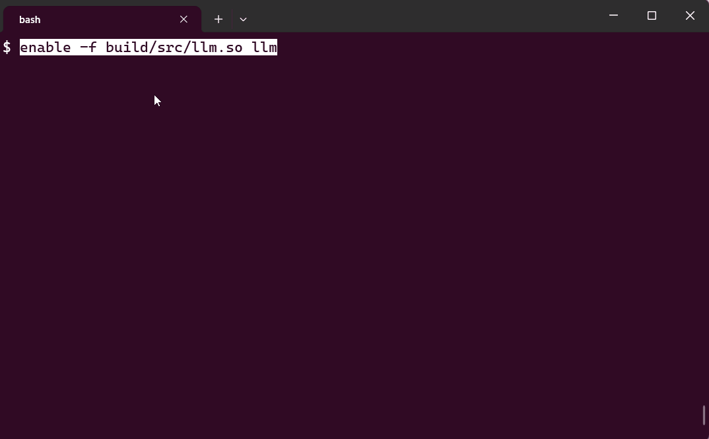

# LLM Bash Builtin

A bash builtin that enables direct chat interaction with LLM providers from your terminal.

Supported providers:
- **GitHub Copilot** (default) - Requires GitHub Copilot subscription
- **LiteLLM** - Local LLM gateway/proxy

## Features

- 🤖 Chat with LLMs directly from bash
- ⌨️ **Readline completion** - Press a key to complete your command with AI (NEW!)
- 💬 Interactive chat mode
- 📝 Custom instructions support
- 🔧 Multiple provider support
- 🎯 Model selection

(Written with the help of an llms)



## Quick Start

### 1. Build

```bash
mkdir -p build && cd build
cmake ..
make
```

### 2. Configure Provider (Optional)

Create a configuration file at `~/.bash_llm/config.json`:

```json
{
  "provider": "copilot",
  "litellm": {
    "base_url": "http://localhost:8000",
    "model": "gpt-3.5-turbo",
    "api_key": "your-litellm-api-key"
  }
}
```

Set `"provider"` to either `"copilot"` (default) or `"litellm"`.

See [config.json.example](config.json.example) for a complete example.

### 3. Load the Builtin

```bash
enable -f /path/to/llm_builtin/build/src/llm.so llm
```

### 4. Start Chatting

On first use with GitHub Copilot, the builtin will automatically prompt you to authenticate with GitHub.

```bash
# Ask a question
llm How do I use grep to search recursively?

# Interactive mode
llm -i
```

## Usage

```bash
llm [options] [message...]

Options:
  -i    Start interactive chat mode
  -n    Start a new chat (clear conversation history)
  -r    Reload configuration from ~/.bash_llm/config.json
  -c    Completion mode (for use with bind -x)
  -m    Override the model for this session
  -h    Show help with current provider and model

Examples:
  llm What is the capital of France?
  llm Explain what this bash command does: find . -name "*.txt"
  llm -i    # Start interactive chat
  llm -m gpt-4o-mini  # Use a specific model for this session
  llm -h    # Show help and configuration
  llm -r    # Reload configuration after editing config.json
  
  # Pipe stdin to add context to your message
  cat error.log | llm "Explain this error"
  
  # Interactive mode with piped input (each line becomes a separate prompt)
  echo -e "What is 2+2?\nWhat is 3+3?" | llm -i
```

## Readline Completion (NEW!)

Bind a key to get AI-powered command completion:

```bash
# Add to your ~/.bashrc
bind -x '"\C-o": llm -c'
```

Now type a partial command and press **Ctrl-O** to complete it:

```bash
$ find . -name <Ctrl-O>
$ find . -name "*.txt" -type f  # ← AI completes the command!
```

See [READLINE_COMPLETION.md](READLINE_COMPLETION.md) for full documentation.

## Custom Instructions

On load, the builtin ensures a custom instructions file exists at `~/.bash_llm/instructions.txt`.
Edit this file to set default guidance applied to every chat request.
```

## Requirements

- Linux system with bash 4.0+
- CMake 3.10+
- libcurl development libraries
- nlohmann/json (automatically fetched by CMake)
- GitHub Copilot subscription (for API access)

## Documentation

See [USAGE.md](USAGE.md) for complete documentation including:
- Detailed usage examples
- Troubleshooting guide
- Advanced usage patterns

## Testing

Run the test script to verify everything is working:

```bash
./test.sh
```

## Original Project

This project was originally a simple cmake template for a bash loadable builtin.
The original autoconf project is in the autoconf branch.
